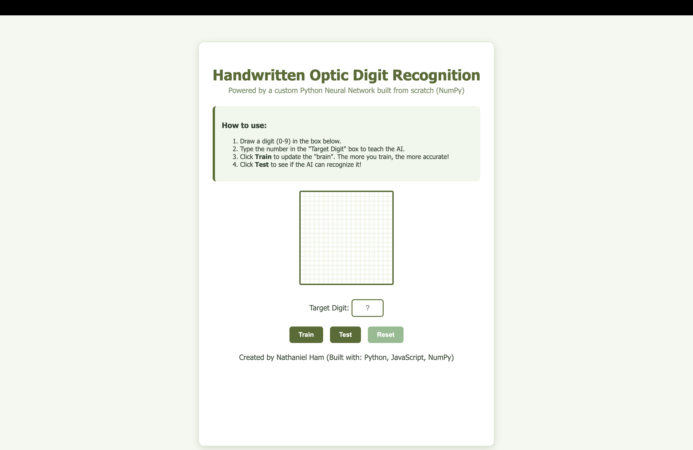
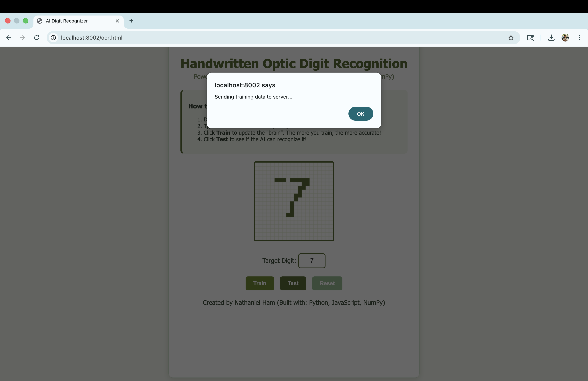
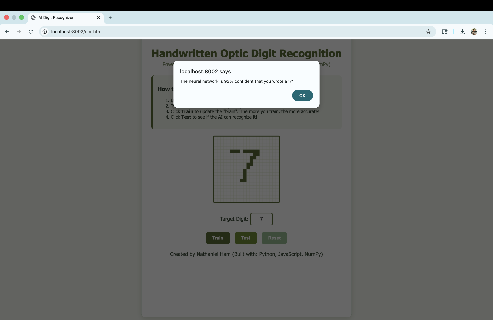

# Handwritten Digit Recognition (From Scratch)

I built this project to understand how Neural Networks actually work under the hood. Instead of using libraries like TensorFlow or PyTorch that do the heavy lifting for you, I built the engine entirely from scratch using Python and NumPy.

It uses a Feedforward Neural Network to recognize handwritten digits (0-9) drawn on an HTML5 canvas in real-time.

## Screenshots

## What it does
* **No Magic Libraries:** The math (Matrix multiplication, Sigmoid, Backpropagation) is all written.
* **Train it yourself:** You can draw a number, tell the AI what it is, and watch it learn in real time, but it still can make errors. The more times it is taught, the more accurate it becomes (so a human).
* **Smart Memory:** I implemented a "replay buffer" system so the AI doesn't forget the number '0' just because you taught it a '1'.
* **Confidence Scores:** It doesn't just guess, it also tells you how sure it is (e.g. "94% confident").

## The Stack
* **Python + NumPy:** The "Brain" (Linear Algebra & Calculus).
* **JavaScript + HTML Canvas:** Pixel capture and processing canvas.
* **Custom HTTP Server:** Handles the communication between the frontend and the brain.

## How to Run It

1. Clone the repo
   git clone https://github.com/YOUR_USERNAME/neural-network-from-scratch.git
   cd neural-network-from-scratch

2. Start the Server
   python3 server.py (on mac) or you can just click run

3. Open the App
   Go to http://localhost:8002/ocr.html in your browser.

## How it works (The Math)
1. **Input:** The canvas takes your drawing and turns it into a grid of numbers (pixels).
2. **Forward Prop:** The machine pushes those numbers through a hidden layer of 15 nodes.
3. **Guess:** It outputs 10 probabilities (one for each digit 0-9).
4. **Learning:** When you click "Train," it compares its guess to the real answer, calculates the error, and adjusts the weights using Gradient Descent.

## Credits
Built by Nathaniel Ham.